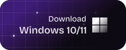
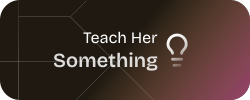
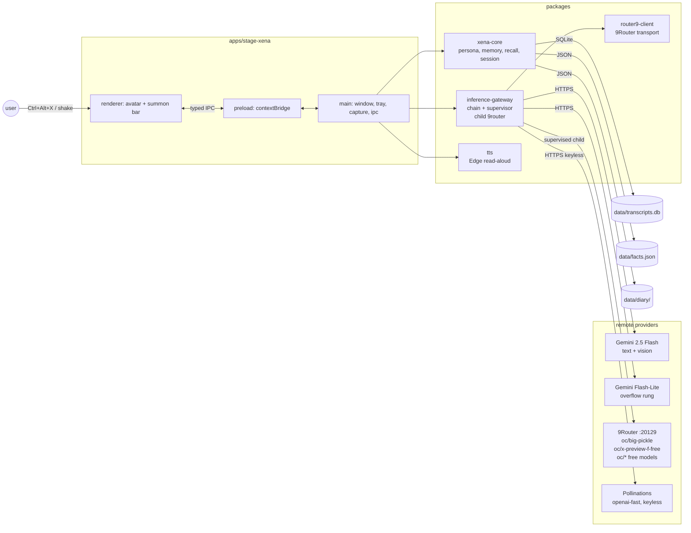

<div align="center">
  
</div>

<h1 align="center">Project Xena</h1>

<p align="center">Your adorable daughter, a little witch living in the bottom-right corner of your screen. She watches your work, talks with you, sees your screen, remembers things you teach her, and occasionally pipes up on her own.</p>

<p align="center">
  <a href="https://github.com/moeru-ai/airi"></a>
  
  
  
  
  
</p>

<p align="center">
  [<a href="#development">Build it</a>]
  [<a href="docs/setup-guide.md">Setup guide</a>]
</p>

<p float="center" align="center">
  <a href="https://github.com/daniswastaken/xena/releases/latest">
    
  </a>
  <a href="docs/setup-guide.md">
    
  </a>
  <a href="https://github.com/daniswastaken/xena/issues/new">
    
  </a>
</p>

> Heavily inspired by [Neuro-sama](https://www.youtube.com/@Neurosama) and architecturally indebted to [Project AIRI](https://github.com/moeru-ai/airi).

> [!TIP]
> Xena is your **AI daughter**, a little witch who treats your desktop as her playground. She's clingy, affectionate, and always eager to help and watch you work.

> [!NOTE]
> All LLM and vision inference is **remote**, none of the heavy LLM computing are done locally.

## What's So Special About This Project?

Project Xena is a **daughter witch avatar** living in the bottom-right corner of your screen. Unlike most AI-VTuber projects that need beefy GPUs or take over your whole desktop, Xena is the user’s AI daughter, a little witch who treats code, design, and screen elements as canvases for magical paint-wand spells.

- Lightweight: runs on weak laptops, no CUDA, no WebGPU, no local models.
- Persistent: always-on-top, click-through overlay in bottom-right corner.

> [!TIP]
> This is a **small, focused project**. The daughter avatar form factor is permanent, and so is the constraint (no local model inference). Long-term direction grows toward AIRI / Neuro-sama capability (real-time voice, proactive behavior, memory, integrations) while keeping the **daughter avatar footprint** intact.

## Current Progress & Roadmap

Shipped:

- **v0.1 —** Project kickoff.
- **v0.2 —** Live2D model.
- **v0.3 —** Vision model.
- **v0.4 —** TTS feature.
- **v0.5 —** Long term memory and knowledge.
- **v0.6 —** Model auto recovery.
- **v0.6.1 —** Packaged `.exe` distribution (NSIS) with bundled 9Router and fresh-machine key bootstrap — build it locally with `pnpm --filter @xena/stage-xena dist`.

Planned:
- **Release channel.** Hosted releases once a public repo/CI is set up; the Windows `.exe` itself is already shippable (see the [setup guide](docs/setup-guide.md), section 5).
- **Real-time voice.** Streaming TTS pipeline replacing Edge read-aloud.

## What Can Xena Do?

### Brain 

| Status | Feature |
|---|---|
| Shipped | Memory: SQLite transcripts + JSON diary + facts store, keyword+recency recall in the system prompt (no embeddings) |
| Shipped | `/remember` · `/forget` · `/clear` · `/help` commands |
| Shipped | Proactive comments + ambient screen glances, unified 5-7 min randomized initiative clock, coin-flip pick, quiet-hours gate, tray-toggleable |
| Shipped | Guided tasks: "how do I…?" starts a vision-driven multi-step desktop tutor |

### Eyes 

| Status | Feature |
|---|---|
| Shipped | Screen vision on command: `/look <question>` shares the screen to the vision chain |

### Mouth 

| Status | Feature |
|---|---|
| Shipped | Lips movement synced to TTS audio duration |
| Planned | Streaming TTS (v4) |

### Body 

| Status | Feature |
|---|---|
| Shipped | Xena avatar (Mao) via `pixi.js` + `pixi-live2d-display` (Cubism 4) |
| Shipped | Mood expression ALTERNATES, random pick per reply |
| Shipped | `TapBody` motions (6 gestures) on all expressive moods |
| Shipped | Gaze tracking: eyes + head follow cursor, holds eye contact while speaking, glances at pointer targets |

## Development

> For detailed instructions to develop this project, read [`AGENTS.md`](AGENTS.md). It is the full handoff document: scope, target machine, infrastructure, source layout, current status, architectural decisions.

> [!NOTE]
> Starting the app starts the whole inference stack: Xena spawns and supervises the 9Router gateway herself (`--port 20129 --no-browser --skip-update`), adopts an already-running instance instead of double-spawning, and respawns it on crash. Gemini and Pollinations are plain HTTPS — always up. If everything is somehow down at once, the tray's "Restart inference" action recovers without restarting Xena.

```powershell
pnpm install
pnpm build         # bundle the app
pnpm start         # run the Electron overlay (inference comes up with it)
pnpm typecheck     # all packages, strict TS
node scripts/run-check.mjs scripts/check-recall.ts   # offline core checks
node scripts/run-check.mjs scripts/check-child9router.ts  # child lifecycle checks
```

### Configuring `.env`

The seed keys are already present. The interesting knobs:

```dotenv
# Gemini — primary provider (free key: https://aistudio.google.com/app/apikey)
XENA_GEMINI_API_KEY=AIza...
XENA_GEMINI_CHAT_MODEL=gemini-2.5-flash
XENA_GEMINI_VISION_MODEL=gemini-2.5-flash
XENA_GEMINI_LITE_MODEL=gemini-2.5-flash-lite

# 9Router — supervised child rung (spawned at app boot)
ROUTER9_BASE_URL=http://localhost:20129/v1
ROUTER9_API_KEY=sk-...
XENA_NINEROUTER_ENABLED=1        # 0 = pure Gemini + Pollinations stack
XENA_TEXT_MODEL=oc/big-pickle
XENA_VISION_MODEL=oc/x-preview-f-free
XENA_FALLBACK_TEXT_MODELS=oc/laguna-s-2.1-free,oc/mimo-v2.5-free
XENA_FALLBACK_VISION_MODELS=oc/mimo-v2.5-free

# Pollinations — keyless final net
XENA_POLLINATIONS_TEXT_MODEL=openai-fast
```

### Architecture

`pnpm` monorepo, TypeScript strict, esbuild bundling.



## Provider Support

Xena walks a failover chain per request. The first healthy rung serves; failures never surface as raw API errors, just persona lines (ADR-004).

| Provider | Role | Status |
|---|---|---|
| [Gemini](https://aistudio.google.com) `gemini-2.5-flash` | **Primary**: text + vision, one free AI Studio key |  |
| Gemini `gemini-2.5-flash-lite` | Overflow rung: same key, higher free rate limits |  |
| [9Router](https://github.com/9router/9router) `oc/*` | Reasoning rung (`oc/big-pickle`, `reasoning_content`) + free vision models, spawned & supervised by Xena at boot |  |
| [Pollinations](https://pollinations.ai) `openai-fast` | Keyless final net |  |
| Microsoft Edge read-aloud | Free TTS, JP `Nanami` voice |  |
| Any OpenAI-compatible provider | Drop a base URL + key in `.env` — failover chain runs unchanged |  |

## Star History

<a href="https://star-history.com/#daniswastaken/project-xena&Date">
  <picture>
    <source media="(prefers-color-scheme: dark)" srcset="https://api.star-history.com/svg?repos=daniswastaken/project-xena&type=Date&theme=dark" />
    <source media="(prefers-color-scheme: light)" srcset="https://api.star-history.com/svg?repos=daniswastaken/project-xena&type=Date" />
    
  </picture>
</a>
