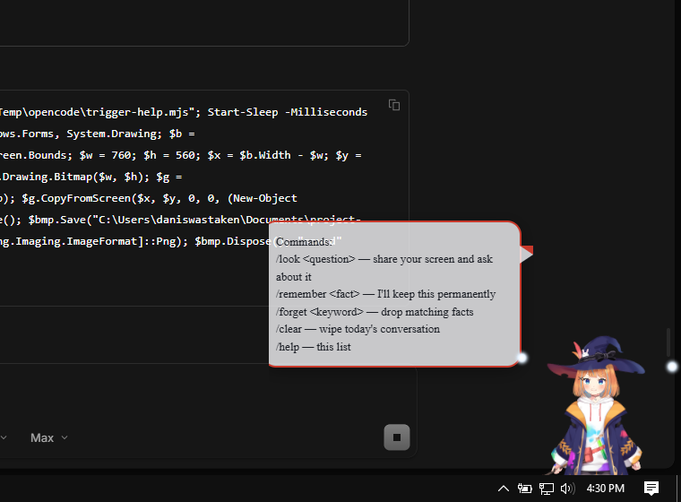

# Project Xena

A Neuro-sama-inspired AI desktop companion: a small character who lives in the
bottom-right corner of your screen, talks with you, sees (when invited),
remembers, and occasionally pipes up on her own.

Built for a weak laptop — all inference is remote, the overlay itself is
plain DOM (optional Live2D stage), footprint stays in the ~230 MB range.



## Features

- **Corner Live2D avatar** — the free Mao Cubism 4 model rendered via
  pixi.js, with mouth flap synced to speech, per-mood expression variants,
  gesture motions on emotes, and **gaze tracking** — she watches your cursor
  and looks where she points. Toggle visibility from the tray (on by default).
  The old PNG sprite stage was retired.
- **Chat** — Spotlight-style input bar (Ctrl+Alt+X or shake your cursor);
  replies stream in a comic speech bubble anchored to Xena's head —
  mood-tinted border, thinking dots while she reasons, hover to scroll,
  select, copy. `/look <question>` screen understanding, `/clear`,
  `/remember <fact>`.
- **Memory** — daily transcripts, nightly in-character diary summaries,
  user-taught facts, keyword+recency recall injected into context. No
  embeddings, no extra inference.
- **Guided tasks** — ask "how do I open YouTube?" and Xena's own cursor
  glides through each visible step. She waits for your screen to change, then
  captures it again and continues until the task is complete.
- **Emotions** — replies lead with a mood tag (`[happy] [smug] [surprised]
  [annoyed] [sleepy]`) that drives the avatar's face and Live2D expressions.
- **Voice** — free Edge read-aloud, mouth synced to audio.
- **Proactive** — after long idleness (quiet hours respected) Xena comments
  on her own, flavored with memory. Optional ambient screen glances
  (default OFF) share a one-line observation of what's on screen.
- **Voice input** — push-to-talk (Ctrl+Alt+V): speak, get transcribed
  through free gpt-audio models, auto-sent as your message.
- **Provider failover** — 9Router primary with free `oc/*` fallback models
  (`oc/laguna-s-2.1-free`, `oc/mimo-v2.5-free`); all targets stay on the same
  gateway, so never a paid provider. Streams never restart after first token.

## Controls

| Action | How |
|---|---|
| Summon bar | `Ctrl+Alt+X` or shake cursor |
| Dismiss | `Esc` or click away |
| Screen look | `/look what is this?` |
| Guide a task | `How do I open YouTube?` — Xena guides each step interactively |
| Teach a fact | `/remember my sister's name is Lena` |
| Drop facts | `/forget lena` |
| Command list | `/help` |
| Voice input | hold a thought, `Ctrl+Alt+V` to start/stop |
| Reset day | `/clear` |
| Settings | tray icon (voice, idle comments, shake, model, Live2D) |

## Architecture

pnpm monorepo, TypeScript strict, esbuild bundling.

- `apps/stage-xena` — Electron app (main / preload / renderer, two windows)
- `packages/router9-client` — all provider API code + failover chains
- `packages/xena-core` — persona, memory (transcripts, diaries, facts,
  recall), conversation session
- `packages/tts` — free Edge read-aloud
- `docs/` — ADRs, vision-model probe results
- `scripts/` — sprite generator, CDP drivers/inspectors, offline check suite

See `AGENTS.md` for the full agent-context handoff and current status.

## Development

```powershell
pnpm install
pnpm build        # bundle app
pnpm start        # run Electron overlay
pnpm typecheck    # all packages
node scripts/run-check.mjs scripts/check-recall.ts   # offline core checks
```

Configure `.env` (see `.env` keys: `ROUTER9_*`,
`XENA_FALLBACK_TEXT_MODELS`, `XENA_FALLBACK_VISION_MODELS`,
`XENA_TEXT_MODEL`, `XENA_VISION_MODEL`).
