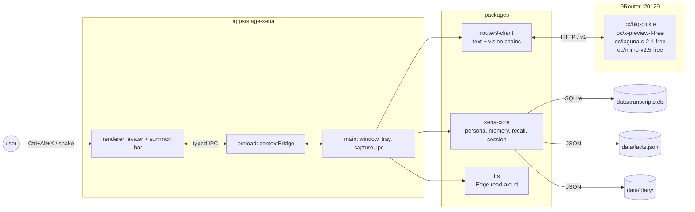

<div align="center">
  <picture>
    <source width="100%" media="(prefers-color-scheme: dark)" srcset="docs/banner-dark.svg" />
    <source width="100%" media="(prefers-color-scheme: light), (prefers-color-scheme: no-preference)" srcset="docs/banner-light.svg" />
    
  </picture>
</div>

<h1 align="center">Project Xena</h1>

<p align="center">A small AI desktop companion living in the bottom-right corner of your screen — talks, sees when asked, remembers, and occasionally pipes up on her own.</p>

<p align="center">
  [<a href="#development">Build it</a>]
  [<a href="AGENTS.md">Agent handoff</a>]
  [<a href="docs/adr-001-failover-recall.md">ADR-001</a>]
  [<a href="docs/adr-002-live2d-pointer.md">ADR-002</a>]
  [<a href="docs/adr-003-speech-bubble.md">ADR-003</a>]
</p>

<p align="center">
  <a href="https://github.com/moeru-ai/airi"></a>
  
  
  
  
  
</p>

<p float="center" align="center">
  <a href="#development">
    
  </a>
  <a href="AGENTS.md">
    
  </a>
  <a href="docs/screenshot.png">
    
  </a>
</p>

> Heavily inspired by [Neuro-sama](https://www.youtube.com/@Neurosama) and architecturally indebted to [Project AIRI](https://github.com/moeru-ai/airi).

> [!TIP]
> Xena is a **corner-overlay companion** — a small persistent presence in the bottom-right of your screen, not a full VTuber stage. If you want a complete AI VTuber with VRM, WebGPU, mobile packaging, game-playing bots and Discord/Telegram integrations, use [Project AIRI](https://github.com/moeru-ai/airi). Xena is the desktop "shrine mascot" form factor: small, persistent, private, tucked into a corner.

> [!NOTE]
> All LLM, vision and speech-to-text inference is **remote** (9Router, port `20129`). The on-device app does no model inference — your laptop just renders the overlay, streams tokens, and talks to Edge TTS. That keeps the steady-state footprint around **~190–230 MB** across a handful of Electron processes, even on a CPU-only Athlon Gold with no CUDA.

> [!WARNING]
> Xena ships a free Live2D model (Mao) bundled under the Live2D Cubism Free Material License. Replace it one-to-one with your own model under `apps/stage-xena/assets/live2d/<name>/` if you want a different avatar.

## What's So Special About This Project?

Project Xena is a **bottom-right corner PNGtuber / Live2D companion** with the discipline of a real monorepo. It exists because most AI-VTuber open source projects either need a beefy GPU for local inference, or want to take over the whole desktop, or both. Xena does neither.

- It runs on a weak CPU-only laptop with shared integrated graphics. Steady-state memory is in the ~190 MB range. No CUDA. No WebGPU required. No local LLM.
- It lives in the corner. The avatar window is transparent, frameless, always-on-top, click-through by default, pinned to the bottom-right. The chat is a Spotlight-style summon bar that fades in on hotkey or cursor shake and fades out on its own. You do **not** have to look at her to use your computer.
- The renderer is plain DOM. The avatar is a single Live2D model rendered through `pixi.js` + `pixi-live2d-display`. There is no three.js, no WebGL pipeline to maintain, no Live2D physics solver in the render path.
- The monorepo is laid out like Project AIRI's: `apps/stage-xena` imports `packages/router9-client` / `packages/xena-core` / `packages/tts`; packages never import apps. The renderer never `fetch`es providers directly — every API call is over IPC through `router9-client`, with a real failover chain.
- All inference routes through 9Router with free `oc/*` fallback models. Streams never restart after the first token, even across a fallback hop. No paid provider keys.

> [!TIP]
> This is a **small**, **focused** project — the form factor (a corner overlay) is permanent, and so is the constraint (no local model inference). Long-term direction is to grow toward AIRI / Neuro-sama capability (real-time voice, proactive behavior, memory, integrations) while keeping the corner-overlay footprint intact.

## Current Progress & Roadmap

Xena has already shipped the v0.1 → v2.0 arc. v3 (real Live2D art from the user) is the only outstanding item.

- [x] **v0.1 — Alive**: Electron overlay bottom-right, text chat via 9Router streaming, token-flap talking
- [x] **v0.5 — Presentable**: real Live2D assets loaded, blink state, chat UX polish, persona tuned
- [x] **v1.0 — Sees**: `desktopCapturer` → JPEG → vision model → on-screen description; verified working
- [x] **v1.5 — Speaks**: Edge read-aloud, mouth flap synced to audio duration
- [x] **v2.0 — Remembers & initiates**: persistent memory, proactive idle comments (quiet-hours gated), global hotkeys
- [x] **Bonus shipped**
  - [x] Live2D avatar (Mao, the one and only model)
  - [x] Mood emotions — replies lead with `[happy] [smug] [surprised] [annoyed] [sleepy]`, drives Live2D face
  - [x] Gaze tracking — eyes and head follow the cursor
  - [x] Speech bubble — mood-tinted, anchored to her head, thinking dots while reasoning
  - [x] Guided tasks — "how do I open YouTube?" → her own cursor drives each step
  - [x] Voice input — push-to-talk `Ctrl+Alt+V` via free `gpt-audio-mini`
  - [x] SQLite transcripts (`node:sqlite`, zero native deps), diary, facts, keyword+recency recall
  - [x] Ambient screen glances (opt-in, default OFF, 30 min cadence, quiet-hours gated)
  - [x] Provider failover chain (9Router → `oc/big-pickle` → `oc/laguna-s-2.1-free` → `oc/mimo-v2.5-free`)
  - [x] Circuit breaker after a 5-min fallback cooldown on quota failure
  - [x] Single-instance lock, start-with-Windows, tray-driven settings
- [ ] **v3 — Own art**: real Live2D model from the user, one-to-one swap under `assets/live2d/<name>/`
- [ ] **v4 — Real-time voice**: streaming TTS pipeline replacing Edge read-aloud
- [ ] **v5 — Multi-channel**: optional HTTP webhook, optional Discord relay (if requested)

## What Can Xena Do?

### Brain

- [x] Text chat, streamed token-by-token from 9Router
- [x] Reasoning model support (`oc/big-pickle` exposes `reasoning_content`; thinking dots show in the bubble)
- [x] Multi-turn conversation with daily session rotation
- [x] Memory: SQLite transcripts + JSON diary + facts store, keyword+recency recall injected into the system prompt (no embeddings, no extra inference)
- [x] Auto-fact extraction — model appends `[fact: ...]` tags, persisted to the facts store
- [x] `/remember <fact>` and `/forget <keyword>` commands
- [x] `/clear` to reset the day, `/help` for the command list
- [x] Proactive idle comments — long-idle trigger, cooldown, quiet-hours gate, tray-toggleable
- [x] Guided tasks — natural-language "how do I…?" starts a multi-step desktop tutor that captures, decides, points, waits for the screen to change, recaptures, and continues until the model says done
- [x] Provider failover chain (text + vision) with circuit breaker
- [x] Failure toast when all providers are dead (5-min throttle)

### Ears

- [x] Push-to-talk voice input — `Ctrl+Alt+V`, mic captured in the renderer, base64 WAV, transcribed via free `gpt-audio-mini` / `gpt-audio` (wrapper-stripped), auto-sent as the user's message
- [x] Mic permission handler, tray toggle, summon-bar listening/transcribing states
- [ ] Real-time VAD (planned for v4)

### Mouth

- [x] Free Edge read-aloud, no key required
- [x] Mouth flap synced to TTS audio duration
- [x] JP `Nanami` voice (always the happy read regardless of face mood), 96 kbit endpoint max
- [x] Voice ON/OFF toggle in the tray, persisted in settings
- [x] Speak toggle per reply (mood-tagged, opt-out via the speech bubble close button)
- [ ] Streaming TTS (planned for v4)

### Body

- [x] Live2D avatar (Mao, the only model) via `pixi.js` + `pixi-live2d-display` (Cubism 4)
- [x] Mouth flap via `ParamMouthOpenY`, jittered lip-sync
- [x] Mood expression ALTERNATES — random pick per reply
- [x] `TapBody` motions (6 gestures) on all expressive moods
- [x] Neutral reset (`exp_01`) on mood decay
- [x] Gaze tracking — `GazeTracker` polls the cursor at 120 ms, eyes + head follow
- [x] Guided-task pointer can drive her gaze
- [x] Avatar visibility toggle in the tray (default ON)
- [x] Capped 30 fps Live2D ticker
- [x] Single-corner pinning, always-on-top, click-through by default, drag via avatar
- [x] Speech-bubble anchored to her head, mood-tinted border, hover to scroll/select/copy

## Development

> For detailed instructions to develop this project, read [`AGENTS.md`](AGENTS.md). It is the full handoff document: scope, target machine, infrastructure, source layout, current status, architectural decisions.

> [!NOTE]
> Make sure 9Router is running on `http://localhost:20129/v1` before starting the app. If `/v1/models` returns nothing, run `9router` in another terminal — Xena will surface a friendly "9Router is down" error in the summon bar if it can't reach the gateway.

```powershell
pnpm install
pnpm build         # bundle the app
pnpm start         # run the Electron overlay
pnpm typecheck     # all packages, strict TS
node scripts/run-check.mjs scripts/check-recall.ts   # offline core checks
```

### Configuring `.env`

The seed API key is already present. The interesting knobs:

```dotenv
ROUTER9_BASE_URL=http://localhost:20129/v1
ROUTER9_API_KEY=sk-...

XENA_TEXT_MODEL=oc/big-pickle
XENA_VISION_MODEL=oc/x-preview-f-free

XENA_FALLBACK_TEXT_MODELS=oc/laguna-s-2.1-free,oc/mimo-v2.5-free
XENA_FALLBACK_VISION_MODELS=oc/mimo-v2.5-free,oc/laguna-s-2.1-free
```

### Architecture

`pnpm` monorepo, TypeScript strict, esbuild bundling.



## Support of LLM / Vision / Speech Providers

Xena talks to one gateway and lets the gateway talk to anything.

- [x] [9Router](https://github.com/9router/9router) — primary gateway, OpenAI-compatible, ~700 free-tier models on port `20129`
- [x] `oc/big-pickle` — primary text/reasoning model (verified, exposes `reasoning_content`)
- [x] `oc/x-preview-f-free` — primary vision model (upstream `mimo-v2.5-free`, image inputs verified)
- [x] `oc/laguna-s-2.1-free` — text fallback
- [x] `oc/mimo-v2.5-free` — text + vision fallback
- [x] `tokenrouter/openai/gpt-audio-mini` — speech-to-text for push-to-talk
- [x] Microsoft Edge read-aloud — TTS, no key, JP `Nanami` voice
- [ ] Any OpenAI-compatible provider — drop a base URL + key in `.env`, the failover chain runs unchanged

## Sub-projects Born From This Project

None yet — Xena is small enough that everything lives in the monorepo. If pieces grow up and want their own repos (a `xena-recall` library, a `xena-tts` server, a `mao-pack` Live2D enhancement kit, …) they will graduate here.

## Acknowledgements

- [Project AIRI](https://github.com/moeru-ai/airi) — the monorepo discipline, the render split, the "soul container" framing. This README is structurally indebted to AIRI's.
- [pixiv/ChatVRM](https://github.com/pixiv/ChatVRM) — original Live2D-on-the-web pattern.
- [josephrocca/ChatVRM-js](https://github.com/josephrocca/ChatVRM-js) — standalone JS conversion.
- Mao sample model, free under the Live2D Cubism Free Material License.
- 9Router team — the gateway that makes free-tier multi-model failover possible.
- Neuro-sama — for the original reason any of this exists.

## Star History

<a href="https://star-history.com/#daniswastaken/project-xena&Date">
  <picture>
    <source media="(prefers-color-scheme: dark)" srcset="https://api.star-history.com/svg?repos=daniswastaken/project-xena&type=Date&theme=dark" />
    <source media="(prefers-color-scheme: light)" srcset="https://api.star-history.com/svg?repos=daniswastaken/project-xena&type=Date" />
    
  </picture>
</a>

## About

A small, persistent, bottom-right-corner AI companion. Tucked into the corner of your screen like a shrine mascot. Built to run on weak laptops with no GPU. Heavily inspired by Neuro-sama, architecturally indebted to Project AIRI.

[dani's GitHub](https://github.com/daniswastaken) · [AGENTS.md](AGENTS.md) · [CHANGELOG.md](CHANGELOG.md)
